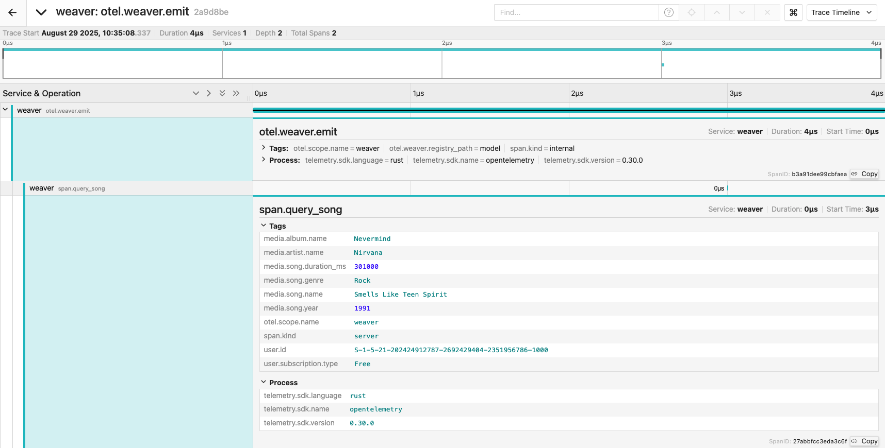
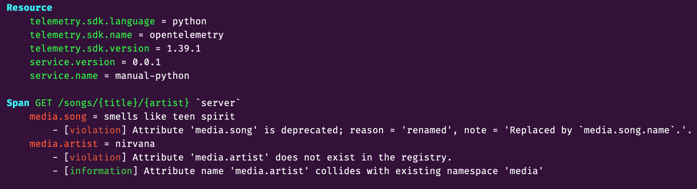

# OpenTelemetry Weaver Guide

This guide explains how to use OpenTelemetry Weaver to generate semantic conventions code and documentation from YAML schema definitions. Weaver is a tool that transforms OpenTelemetry semantic convention specifications into various output formats including code artifacts and documentation.

## What is Weaver?

OpenTelemetry Weaver is a code generation and documentation tool that:

- Processes semantic convention YAML models
- Generates type-safe code for multiple programming languages
- Creates consistent documentation from schema definitions
- Validates and resolves semantic convention registries

## Prerequisites

First, pull the Weaver Docker image:

```bash
docker pull otel/weaver:v0.16.1
```

## Directory Structure

This project expects the following directory structure:

- `model/` - Contains YAML schema definitions (e.g., `attributes.yaml`)
- `templates/` - Contains Jinja2 templates for code generation
- `docs/` - Output directory for generated documentation
- `src/` - Output directory for generated source code

## Commands Overview

### 1. Resolve Schema Registry

**Purpose**: Validates and resolves your semantic convention schema, checking for errors and dependencies.

```bash
docker run --rm \
    --mount 'type=bind,source=./templates,target=/home/weaver/templates' \
    --mount 'type=bind,source=./model,target=/home/weaver/model' \
    otel/weaver:v0.16.1 \
    registry resolve \
    -r model
```

**What this does**:

- Mounts your local `templates/` and `model/` directories into the container
- Runs `registry resolve` to validate the YAML schema files in the `model/` directory
- Checks for syntax errors, missing references, and schema compliance
- Outputs validation results and any errors found

**When to use**: Run this first to ensure your schema definitions are valid before generating code or docs.

### 2. Generate Documentation

**Purpose**: Creates markdown documentation from your semantic convention schemas using official OpenTelemetry templates.

```bash
docker run --rm \
    --mount 'type=bind,source=./model,target=/home/weaver/model' \
    --mount 'type=bind,source=./docs,target=/home/weaver/docs' \
    otel/weaver:v0.16.1 \
    registry generate \
    -r model \
    --templates "https://github.com/open-telemetry/semantic-conventions/archive/refs/tags/v1.34.0.zip[templates]" \
    markdown docs
```

**What this does**:

- Mounts your `model/` directory (input schemas) and `docs/` directory (output)
- Downloads official OpenTelemetry documentation templates from GitHub (v1.34.0)
- Generates markdown files documenting your semantic conventions
- Creates structured documentation following OpenTelemetry standards

**Output**: Markdown files in the `docs/` directory describing your attributes, metrics, and other semantic conventions.

### 3. Generate Source Code

**Purpose**: Generates programming language-specific code artifacts (constants, enums, etc.) from your semantic conventions.

```bash
docker run --rm \
    --mount 'type=bind,source=./templates,target=/home/weaver/templates' \
    --mount 'type=bind,source=./model,target=/home/weaver/model' \
    --mount 'type=bind,source=./src,target=/home/weaver/src' \
    otel/weaver:v0.16.1 \
    registry generate \
    -c templates/registry/code/weaver.yaml \
    -r model \
    code src/
```

**What this does**:

- Mounts `templates/`, `model/`, and `src/` directories
- Uses the configuration file `templates/registry/code/weaver.yaml` to determine:
  - Which programming languages to generate code for
  - What types of artifacts to create (constants, enums, classes)
  - Output file naming and structure
- Processes your YAML schemas and generates type-safe code
- Outputs language-specific files to the `src/` directory

**Output**: Source code files (e.g., `Attributes.java`, `attributes.py`, `attributes.rs`) containing constants and types for your semantic conventions.

### 4. Emit Example Telemetry

**Purpose**: Demonstrates the generated semantic conventions in action by running a sample application that emits telemetry data using the generated code artifacts.

```bash
cd .. & docker compose --profile weaver-emit up
```

Navigate to Jaeger at <http://localhost:16686/> and check the received trace:



**What this does**:

- Changes to the parent directory where the Docker Compose configuration is located
- Starts the `weaver-emit` profile, which uses the generated semantic convention code to emit example telemetry data
- Sends telemetry to Jaeger

**Output**: Live telemetry data (spans) that demonstrate your custom semantic conventions in action, visible in Jaeger.

### 5. Validate Your Telemetry

**Purpose**: Tests the generated semantic conventions by running a validation service and triggering telemetry generation to verify everything works correctly.

This can be included in your CI/CD pipeline to ensure your team is producing telemetry following your internal semantic conventions.

```bash
cd .. && docker compose --profile weaver-check up
```

In another terminal, make a request to generate telemetry:

```bash
curl localhost:5000/songs/smells%20like%20teen%20spirit/nirvana
```

Check the Docker Compose logs to see the telemetry validation output and any errors:



In this sample, the app is producing a span with the attributes `media.song` and `media.artist`.
Weaver complains and raise an error to inform that:

- `media.song` is deprecated
- `media.artist` does not exist in the registry

**What this does**:

- Starts the `weaver-check` profile, which runs Weaver Live Check and a sample service
- The service listens on port 5000 and is ready to process requests
- Making the `curl` request triggers the service to emit a span containing a non-compliant attributes
- Logs show that `media.artist - Does not exist in the registry` and `media.song - Is deprecated`

**Output**: Console logs showing Weaver Live Check validation results, including error messages for non-compliant attributes (`media.artist - Does not exist in the registry` and `media.song - Is deprecated`), service startup messages, and real-time validation feedback that can be integrated into CI/CD pipelines to enforce semantic convention compliance.

## Typical Workflow

1. **Define your schemas**: Create or modify YAML files in the `model/` directory
2. **Validate**: Run the resolve command to check for errors
3. **Generate documentation**: Create readable docs for your team
4. **Generate code**: Create source code artifacts for your applications
5. **Integrate**: Use the generated code in your OpenTelemetry instrumentation

## Configuration Files

- `model/attributes.yaml` - Defines semantic convention attributes
- `templates/registry/code/weaver.yaml` - Controls code generation settings
- Template files in `templates/registry/code/` - Jinja2 templates for different languages

## Troubleshooting

- **Mount errors**: Ensure all referenced directories exist before running commands
- **Schema validation errors**: Check YAML syntax and required fields in your model files
- **Template errors**: Verify template syntax and that all referenced model properties exist
